# Cycle Tour Planner — Architecture Design Document

**Status**: Draft
**Author**: Claude (with Greg Frazier)
**Date**: 2026-07-09 (revised 2026-07-10 — Web security-model pivot, see §2 Principle 6 and §8.1; revised 2026-07-11 — realigned to PRD UX pass: guest browser-local persistence, FR32 version-check sync replacing last-write-wins, QR/CTAP-hybrid as preferred passkey-linking path, geocoding dependency (FR34), route-shape selection (FR35), trip library (FR36), guest→account import (FR37), and a resolved tile-distribution model)
**Source**: `Cycle Tour Planner PRD.md` (all FR/NFR/§ references below point there), `ROADMAP.md`, `UX.md`, `Brand Guide.md`

---

## 1. Purpose & Scope

This document translates the PRD's functional requirements and non-functional constraints into a concrete system architecture: components, their boundaries, how data flows between them, and how the system deploys. It does not restate product rationale already covered in the PRD — see that document for *why*, this one for *how*.

Where the PRD is silent or ambiguous on an architectural point, this document proposes a specific design and **flags it explicitly in §11** rather than quietly picking one. Several of those flags matter more than they look — they determine how the client talks to the backend, so they should be resolved before M2 (API wrap) locks in a client/server contract.

---

## 2. Architectural Principles

Carried forward from PRD §4.4 and §6, restated as constraints on the design:

1. **Local-first compute is a Desktop/Mobile guarantee, not a whole-system rule.** Route generation must not require a network call in the common case **on Desktop and Mobile** — that's the actual product value (planning and riding with zero signal). Web is a different animal: no browser runs OSMnx offline without a WASM port that isn't in scope, so Web has always structurally required the hosted API for compute. Earlier drafts of this document treated that as a narrow "exception" to a universal local-first rule; as of 2026-07-10 it's instead treated as Web's baseline architecture — **Web is a first-class, conventionally server-backed surface**, not a local-first client that happens to run in a browser. See §11.T/§11.U for the resulting open questions, and the accompanying PRD recommendation for how PRD §3.3/§4.4 should be reworded to match.
2. **One routing core, multiple deployment shells.** The OSMnx/Python routing logic should not be duplicated between a "local" and "hosted" implementation — it's one library, invoked by FastAPI wherever FastAPI happens to be running (§4).
3. **Open data, open source, self-hosted tiles.** No proprietary maps SDK, no third-party tile host (§5.3 PRD).
4. **One Flutter codebase, platform differences isolated behind interfaces.** Desktop/Web/Android/iOS share business logic; only genuinely platform-bound concerns (background GPS, biometric plumbing, local file storage backend) fork.
5. **Narrow, separately-scoped server exceptions — for Desktop/Mobile.** Per the PRD's own risk register (§7), the hosted service's Desktop/Mobile-facing responsibilities (auth+share, sync) must stay distinct and narrowly scoped, not fold into one general-purpose backend. Web's use of the same hosted service is not scoped this way — Web is meant to depend on it fully, by design (Principle 1).
6. **Two session models, chosen per platform capability — not one model stretched across both.** Web gets a conventional server-side session (opaque session ID in an HttpOnly cookie, backed by a Postgres session row, revoked by deleting that row) because it's an inherently online surface with a real cookie jar. Desktop/Mobile keep a native access+refresh token pattern because they're apps without one — that pattern was already correct for native clients and isn't changing. The only thing that changes is that Web's session no longer has to *pretend* the server is optional: the earlier design ran the same refresh-token-rotation scheme everywhere specifically to avoid writing a server-side session row, which cost real complexity (§8.1) for a guarantee (avoiding server storage) that Render's Postgres dependency for accounts/sync had already broken. Guest sessions (FR22) remain server-storage-free — no email, account, or personal detail ever reaches Postgres, a privacy commitment to anonymous users rather than a cost-avoidance one, and it's unaffected by this change (§8.2). As of the 2026-07-11 PRD UX pass this is explicitly a *server-side* guarantee only: the guest client now persists in-progress work (route/trip state, layer toggles, form inputs) in the browser's own IndexedDB/localStorage, so a refresh or closed tab doesn't lose it (§4, §6, §7.2). That's a client-side UX improvement, not a retreat from the privacy guarantee — the server still never sees or stores it.
7. **Reconciliation is a user-facing decision, never a silent merge or overwrite.** FR32 replaces implicit last-write-wins with an explicit version-check at both trip-open and immediately-before-save: if the server holds a newer version, the user chooses to save-as (keep both) or overwrite. Cross-device sync (FR21) also now carries non-trip preferences — layer visibility by size-class (FR8) and the contrast-mode override (PRD §6, §9 item 19) — over the same account-level channel, not a separate mechanism (§7.3, §8.3).

---

## 3. System Context (C4 Level 1)

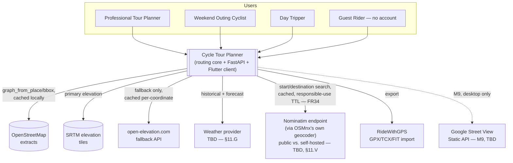

---

## 4. Container / Deployment Topology (C4 Level 2)

This is the section that resolves the PRD's most consequential implicit design choice: **the same FastAPI + routing-core codebase runs in two shapes** — a single-tenant *local* instance the Desktop client owns, and a multi-tenant *hosted* instance on Render that the Web client (both guest and signed-in) and cross-device sync depend on. Mobile is a consumer of both, but does not run the routing core itself (see §11.B).

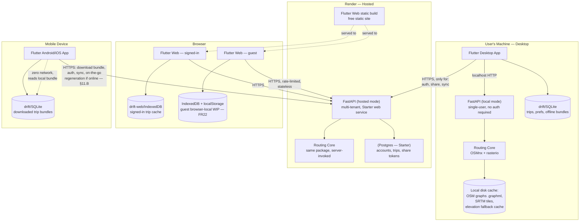

**Key design decisions this implies:**

| Decision | Rationale |
|---|---|
| Routing core is a standalone Python package, imported by FastAPI, not written inline in route handlers | Same logic runs in both local and hosted FastAPI processes without duplication (Principle 2) |
| Local FastAPI instance has no auth and no Postgres | It's single-user by construction — the machine's own file permissions are the trust boundary |
| Hosted FastAPI instance is the *only* place Postgres exists | Keeps "server-side by exception" honest — no shadow database creeping into the local path |
| Desktop only calls the hosted API for auth/share/sync, never for routing | Preserves the local-first NFR (§4.4) — Desktop must not require network for FR1–FR5 |
| Web (both modes) always calls the hosted API | Browsers can't run a local Python/OSMnx process — this is structural, not a choice |
| Web signed-in uses a conventional server session (HttpOnly cookie + Postgres session row), not the Desktop/Mobile access+refresh token pattern | Web already fully depends on the hosted API (Principle 1); a plain, revocable session is simpler and doesn't buy anything by avoiding server storage the way it did under the old zero-footprint principle (§2 Principle 6, §8.1) |
| Web guest persists in-progress work in browser-local IndexedDB/localStorage, never Postgres | FR22's privacy guarantee (§2 Principle 6) is about server-side storage only — client-side persistence was always compatible with it; keeps guest UX resilient to refresh/tab-close without touching the hosted DB |
| Hosted FastAPI generates and caches map tiles on-demand per trip bounding box, serving both Web directly and as the origin Desktop/Mobile pull their offline bundle from | Resolves §11.E — one tile-generation pipeline instead of duplicating it per platform (PRD §5.2/§5.3, resolved PRD item 8) |

---

## 5. Component Breakdown

### 5.1 Routing Core (`backend/routing_core/` — proposed package, currently flat in `backend/main.py`)

Pure-Python library, no FastAPI/HTTP concerns inside it — testable standalone and reusable from a CLI (useful for the tile-generation and batch-elevation-caching workflows, which run outside the request path).

| Module | Responsibility | FR/NFR |
|---|---|---|
| `graph_store` | `graph_from_place`/`graph_from_bbox` + `ox.settings.use_cache`, `save_graphml`/`load_graphml` | §5.1, FR1–FR5 |
| `elevation` | Local SRTM read (`rasterio`), open-elevation.com fallback with a persistent per-coordinate cache, flat-earth (0.0m) final fallback | FR1, FR2, §7 risk row |
| `weighting/` | One scoring strategy per theme: `flattest.py`, `most_climbing.py`, `lowest_traffic.py`, `fewest_turns.py`, `most_art_history.py` — common interface so M1 output is directly pluggable into FastAPI at M2 | FR1–FR5 |
| `turns` | Heading-change turn counter, single documented threshold constant | FR4 |
| `surface` | Surface-type tagging/scoring, sliding-scale avoid↔prefer | FR12, FR13 |
| `trip_split` | Multi-day splitting by min/max mileage + elevation cap; waypoint-constrained routing between forced stops | FR10, FR11 |
| `weights_by_position` | Position-varying weight scoping (tour/day/partial-day override) — explicit v2 layer on top of `weighting/`'s scalar functions, not a rewrite (per PRD §7 risk mitigation) | FR13 |
| `export/` | `gpx.py`, `tcx.py`, `fit.py`, `geojson.py` writers | FR9, FR26 |
| `tiles/` | Per-trip bounding-box tile generation — invoked as a one-off CLI step on Desktop/Mobile, and imported directly by the hosted `tiles` router (§5.2) to serve Web on-demand; not a standing server in either case | §5.2, §5.3, §7, resolves §11.E |

### 5.2 FastAPI Middle Layer (`backend/`)

Single codebase, mode-switched by config/env (`APP_MODE=local|hosted`) rather than a fork — routers that don't apply to a mode are simply not mounted.

| Router | Mounted in | Responsibility | FR |
|---|---|---|---|
| `routing` | both | Wraps routing core; async/background-task pattern for multi-day compute; accepts route-shape (loop/out-and-back/point-to-point) as an input orthogonal to theme | FR6, FR35, §5.2 |
| `trips` | both | CRUD over trip documents, plus library operations (list/search/rename/duplicate/delete, share-revoke) for signed-in accounts, and the guest→account import endpoint (§7.5); local mode persists to the client's own store via response payloads only (FastAPI itself stays stateless in local mode — see §11.D) | FR10, FR11, FR36, FR37 |
| `export` | both | GPX/TCX/FIT/GeoJSON generation | FR9, FR26 |
| `layers` | both | OSM tag-category metadata for layer toggles; size-class-bucketed persistence/sync of a user's choices lives in `sync`, not here | FR8 |
| `tiles` | hosted only (Desktop/Mobile generate locally via the offline tool, §5.1) | On-demand, bbox-scoped tile generation + cache for a requested trip; serves Web directly and is also the origin Desktop/Mobile pull their offline bundle from | PRD §5.2/§5.3, resolves §11.E |
| `geocoding` | both (mode TBD — §11.X) | Wraps OSMnx's own `geocode`/`geocoder` module (consistent with §5.1's "use OSMnx's own tool, not a separate pipeline" bias — same reasoning as graph caching) for start/destination search. This is a thin call-through, not a bundled index: OSMnx's geocoder makes an HTTP call to a configurable Nominatim endpoint — public `nominatim.openstreetmap.org` by default, or self-hosted (§11.V) | FR34 |
| `auth` | hosted only | WebAuthn passkey registration/verification, CTAP hybrid QR-based cross-device linking (preferred path), magic-link issuance/consumption (fallback + recovery) | FR19 |
| `share` | hosted only | Share-token issuance/revocation, unauthenticated read of shared trips | FR20 |
| `sync` | hosted only | Per-account trip reconciliation via explicit version-check-on-open-and-save (FR32, §7.3, resolves §11.K), plus non-trip preference sync (layer visibility by size-class, contrast-mode override — FR8, PRD §9 item 19; conflict semantics for prefs TBD, §11.AA) | FR21, FR32 |
| `guest` | hosted only | Rate-limited, fully stateless routing/export/weather for unauthenticated sessions — server-side statelessness only; the client separately persists WIP browser-locally (§6, §7.2, revised 2026-07-11) | FR22, §11.L |
| `weather` | both | Proxies a still-undecided provider; local mode caches historical norms, hosted mode also serves live forecast | FR15, §11.G |

### 5.3 Flutter Client (`client/`)

| Layer | Responsibility | Notes |
|---|---|---|
| `core/` (shared) | Domain models, API client, theming (Brand Guide.md), state management | Framework choice (Riverpod/Bloc/Provider) not yet decided — §11.C |
| `core/api/` | Environment-aware HTTP client — base URL resolves to `http://localhost:<port>` (Desktop, local mode) or the Render hosted URL (Web, mobile sync/auth, mobile on-the-go compute) | Needs the mode question in §11.N resolved to know when a signed-in Desktop app should route locally vs. call hosted |
| `core/storage/` | `drift`/SQLite abstraction — trips, layer prefs, downloaded offline bundles | Web guest mode uses a separate, lighter browser-local store (IndexedDB/localStorage) instead of `drift` — not no storage at all, revised 2026-07-11 (§6) |
| `core/map/` | `flutter_map` + self-hosted tile source + toggleable OSM-tag layers + start/destination entry (geocode search, map tap, or GPS) and route-shape (loop/out-and-back/point-to-point) selection | FR7, FR8, FR34, FR35 |
| `core/theme/` (shared) | Indoor/Outdoor contrast-mode system — automatic default by device type/viewport/ambient light, manual override synced account-side | Brand Guide.md, PRD §6, §9 item 19; shares its two-bucket (large/fullscreen vs. compact/phone) model with FR8's layer-visibility sync |
| `core/auth/` | WebAuthn/`passkeys` plugin + CTAP hybrid QR cross-device linking, shared flow across platforms | FR19; flagged as highest cross-platform risk in PRD §7 |
| `features/routing`, `features/trip_planning`, `features/offline`, `features/weather`, `features/lodging` | Feature-sliced UI on top of `core/` | — |
| Platform shells (`android/`, `ios/`, `linux/`+`windows/`+`macos/` desktop, `web/`) | Only where Flutter forces it: background GPS, biometric plumbing, desktop windowing | Principle 4 |

---

## 6. Data Architecture — what lives where

| Data | Local (Desktop) | Hosted (Render Postgres) | Mobile (downloaded) | Web guest |
|---|---|---|---|---|
| OSM graph cache (`.graphml`) | Disk, per-region | Disk, per-region (ephemeral instance storage — regenerable, not backed up) | N/A (consumes pre-computed routes only, §11.B) | N/A |
| SRTM tiles / elevation fallback cache | Disk | Disk (server-side) | Bundled subset for trip's bbox | N/A |
| Trip documents (route, waypoints, days, weights) | `drift`/SQLite, canonical while offline | Canonical copy for signed-in accounts, reconciled via version-check-on-open-and-save (FR32, §7.3) | `drift`/SQLite, downloaded bundle | IndexedDB — browser-local, same-browser/same-device only; survives refresh/tab-close but never syncs and never reaches Postgres (FR22, revised 2026-07-11) |
| User preferences (layer visibility by size-class, contrast-mode override) + in-progress form state | `drift`/SQLite | Postgres, synced via `sync` router alongside trip data (FR21, FR8, PRD §9 item 19) | `drift`/SQLite (downloaded/synced) | localStorage — browser-local only, never synced (FR8, FR22) |
| Accounts, passkey credentials, share tokens | — | Postgres | — | — |
| Session/auth state | Refresh token in Keychain/Keystore only (no local record) | Web session rows (§8.1); refresh-token-family hashes for Desktop/Mobile theft detection | Refresh token in Keychain/Keystore only | Guest session token — server-side in-memory only, never Postgres (§8.1, §8.2); distinct from the client's own browser-local WIP storage above |
| Map tiles (MBTiles or similar) | Generated per-trip via offline tool (§5.1) | Generated on-demand per requested trip bbox by the `tiles` router (§5.2), cached — also the origin Desktop/Mobile pull their offline bundle from (resolves §11.E; concrete generation tool still TBD) | Downloaded bundle, sourced from the hosted tile cache | Fetched live from the hosted `tiles` router — no local generation path |

---

## 7. Key Data Flows

### 7.1 Desktop, signed-out — local route generation (no network)

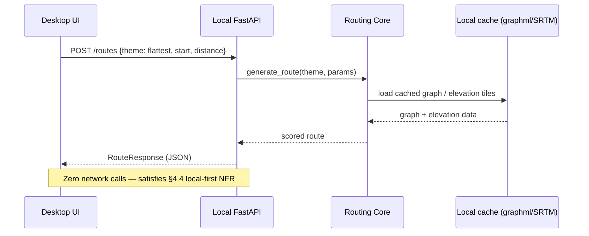

Assumes the start point is already resolved (FR34, the mandatory first step of every flow — PRD §3.4/§6). Whether *that* resolution itself requires network (geocoding) or stays fully local on Desktop is open — see §11.X.

### 7.2 Web guest — stateless hosted compute

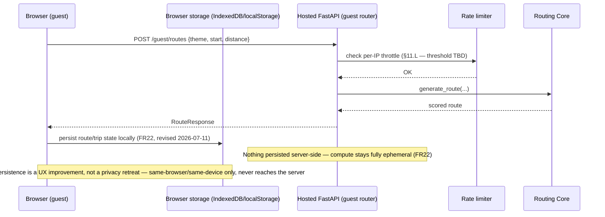

### 7.3 Cross-device sync — version-check on open and on save (FR32)

Supersedes the earlier bare last-write-wins design (resolves §11.K). Two independent checkpoints — not one — because an open-only check misses the case where two devices open the same version and edit in parallel; only the save-time check catches that.

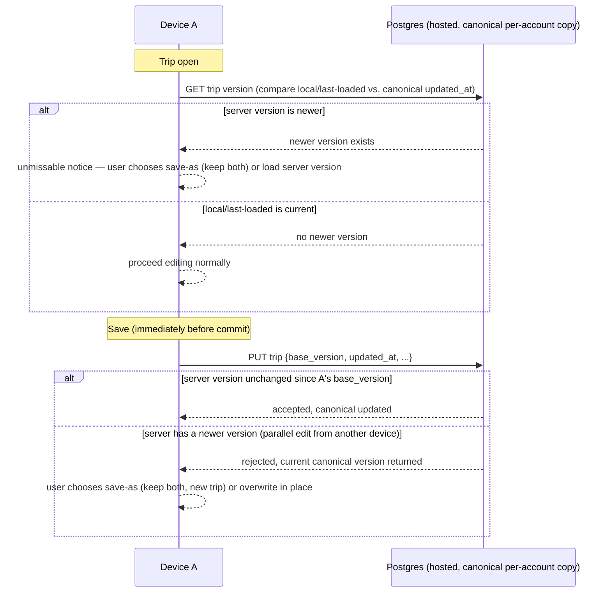

Whole-trip granularity, not field-level — the system never diffs or merges individual fields; a conflict at either checkpoint is always a user-facing choice (PRD §9 item 14, §7 risk row). The save-as path produces an ordinary trip in the library (FR36). Whether this same version-check semantics extends to the non-trip preference sync riding the same `sync` router (layer visibility, contrast-mode override) or whether plain last-write-wins is acceptable there is open — see §11.AA.

### 7.4 Mobile — offline trip use

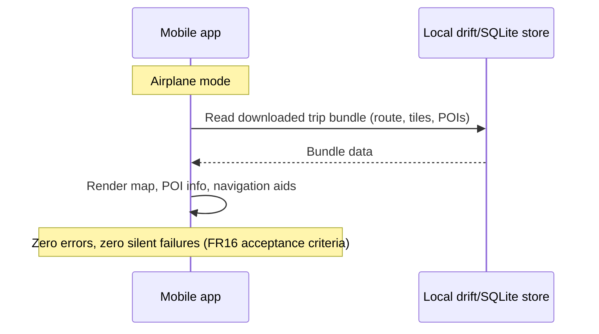

### 7.5 Guest → account import (FR37)

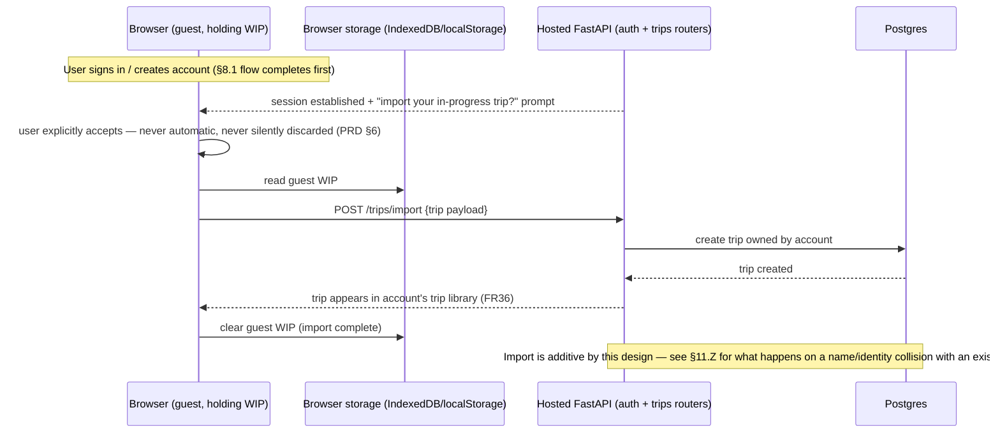

---

## 8. Cross-Cutting Concerns

### 8.1 Authentication & Session Security Model

FR19 specifies the *shape* (passkey-first, magic-link solely for device registration, no password/SMS-OTP ever) but not the mechanics. This subsection proposes a concrete model. It lives entirely in the hosted `auth` router — local mode never authenticates (see trust-boundary note below).

**Core principle**: a magic link only ever proves "you control this email" and unlocks a short-lived, single-purpose *registration ticket* for binding a new passkey. It never issues a session by itself. This is the load-bearing security decision in the whole model — treating email as a gate on a ceremony, not as a login method, keeps an attacker who phishes/compromises the inbox from getting anything more than the ability to *attempt* a new-device registration (which, per the recovery flow below, notifies existing devices).

**Two new-device linking paths, ranked** (revised 2026-07-11 per PRD FR19). The **preferred** path is **QR-code cross-device authorization** — the standard FIDO2/CTAP hybrid "use a passkey from another device" flow, where an already-trusted device scans a QR code shown on the new device and vouches for it directly, with no email round-trip and no personal details exchanged. Magic link is now explicitly the **fallback**, used only when no already-trusted device is present (e.g. a truly first device on the account), and is also promoted to the **explicit account-recovery path** (all devices lost) rather than an implicit reuse of the registration ceremony. The security property that matters — email only ever gates a ceremony, never issues a session directly — holds for the magic-link path; the QR/CTAP path doesn't touch email at all, so it doesn't need that property to begin with. A device pending passkey binding is never blocked from using the app: it gets full local-first/guest-tier planning capability (route generation, layer toggles, export) immediately — only account-scoped surfaces (sync, save-to-account, share-back) wait on the passkey completing (FR19).

**Two session models, one platform-appropriate each** (§2 Principle 6). Earlier drafts used the same access+refresh token scheme on every platform, including Web, specifically so the server would never have to hold a session row — consistent with a zero-cloud-footprint principle. That principle is retired (§2 Principle 1/6): Render's Postgres is already the source of truth for accounts, passkey credentials, and cross-device sync, so avoiding a session row bought nothing except rotation-logic complexity. Web now gets a **conventional server-side session**: an opaque session ID in an HttpOnly+Secure+SameSite cookie, backed by a Postgres row (`user_id`, `created_at`, `last_seen_at`, `expires_at`, device/UA fingerprint, `revoked_at`). Logout, or an admin/self-service "sign out this device," is a direct delete/revoke of that row — immediate, real revocation, no theft-detection heuristics required. Desktop/Mobile **keep** the access+refresh pattern — not because of the old footprint principle, but because it's the right pattern for a native app with no HttpOnly cookie jar to lean on; a longer-lived bearer credential there still needs its own rotation/reuse-detection story.

**Token inventory:**

| Token / session | Platform | Lifetime | Storage | Revocation |
|---|---|---|---|---|
| Magic link | all | 15 min, single-use | Hash only in Postgres (never the raw token) | consumed atomically |
| Registration ticket | all | 5 min, single-purpose | Server-side, tied to the consumed magic link | one-shot |
| WebAuthn challenge | all | ~60s | Server-side, per attempt | one-shot |
| CTAP hybrid QR payload | all (new-device linking, preferred path) | ~60s, matches WebAuthn challenge lifetime | Server-side, per attempt, tied to the requesting new device's session | one-shot; consumed when the trusted device completes the hybrid assertion |
| **Web session** | Web only | 30-day sliding expiration | HttpOnly+Secure+SameSite cookie (opaque session ID) + Postgres session row | Delete/mark-revoked the Postgres row directly |
| Native access token | Desktop/Mobile only | ~15 min | Platform secure storage (Keychain/Keystore) | short-lived by design, not rotated — just re-minted from the refresh token |
| Native refresh token | Desktop/Mobile only | 30–90 days | Keychain/Keystore | rotates every use; reuse of an already-rotated-out token revokes the entire session family (theft signal) |
| Share token (FR20) | all | until revoked | Opaque random string, DB row with `revoked_at` | not rotating — revoke, don't rotate |
| Guest session token (FR22) | Web guest only | ~1hr | In-memory/short-TTL store, keyed by IP+token | never persisted to Postgres — a deliberate **privacy** exception, not a cost-avoidance one; unaffected by this pivot (§8.2) |

Practically: the CORS/cookie-domain mechanics of the Web session (the Flutter Web static build and the hosted API are two separate Render origins) are a real open implementation question — see §11.T.

**New-device registration — QR/CTAP hybrid (preferred path)**, used whenever an already-trusted device is available to do the vouching:

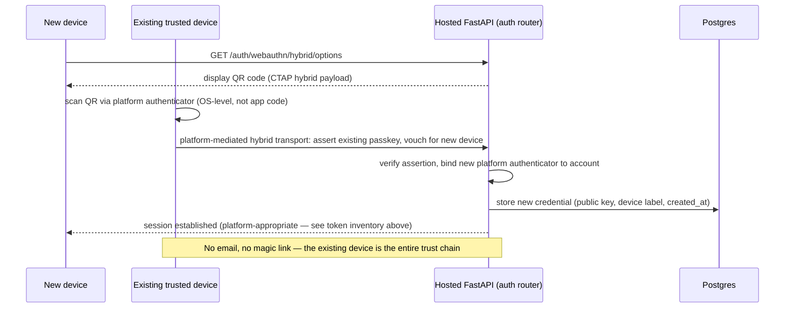

**New-device registration — magic-link fallback path**, used only when no already-trusted device is present to scan a QR code (e.g. the account's very first device):

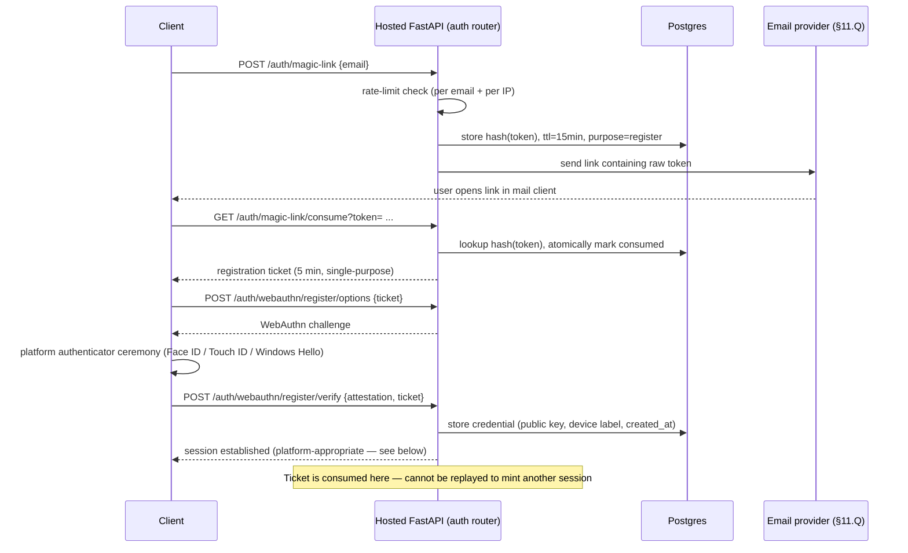

*What "session established" returns differs by platform, per the token inventory above*: Web receives `Set-Cookie` for a new Postgres-backed session row; Desktop/Mobile receive an access token + refresh token pair. The ceremony up to that point is identical everywhere — only the final artifact is platform-appropriate.

**Returning-device login** (no email step at all):

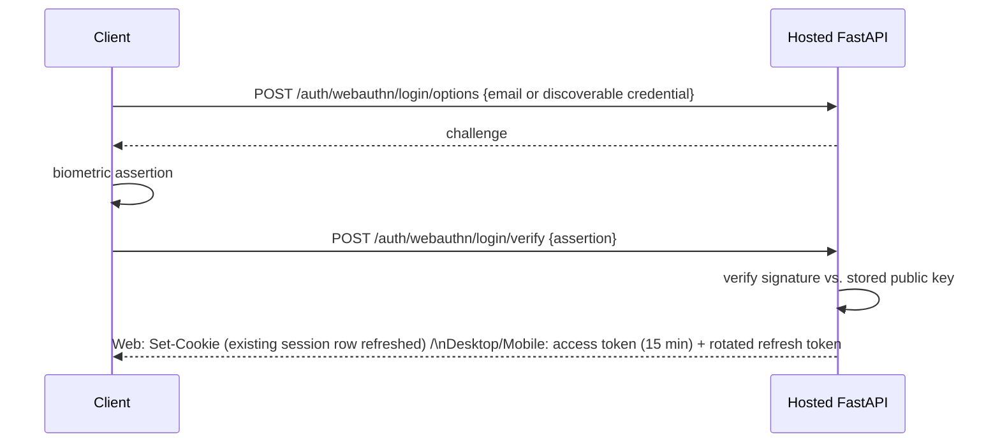

*Note on `sign_count` clone detection*: the WebAuthn spec's usual anti-cloning check (rejecting a non-increasing signature counter) should be **logged, not hard-enforced** — synced/discoverable passkeys (iCloud Keychain, Google Password Manager) legitimately report a static or zero counter across devices, so a hard-fail here would lock out legitimate users. See §11.R.

**Account recovery** (resolved by PRD FR19 as of the 2026-07-11 UX pass — magic link is now explicitly named as the account-recovery path, not just this document's proposal). If every registered device/passkey is lost, recovery reuses the *exact same* magic-link registration ceremony above (`purpose=recover` instead of `purpose=register`), so a compromised inbox never grants more than "attempt a new device registration" — and any *existing* registered device gets a "new device registration requested" notification (email/push) with a one-tap revoke, giving the real owner a chance to reject a hijack attempt before it completes. This closes §11.O — the mechanism proposed there is now the specified design, not an open gap:

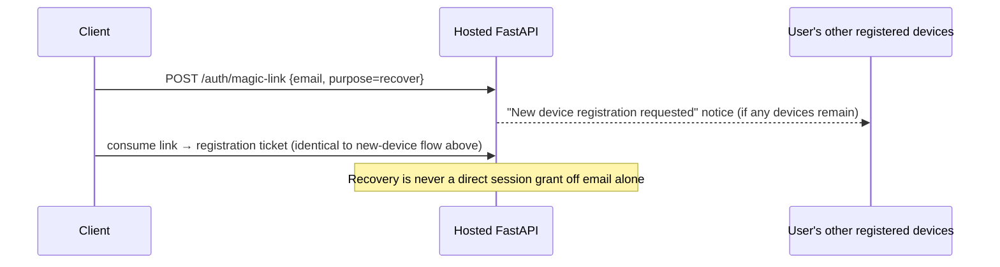

**Local-mode trust boundary.** The local FastAPI instance holds no session material for the hosted API at all — the Flutter Desktop client's HTTP client talks to the hosted API directly for auth/share/sync, bypassing local FastAPI entirely, so refresh tokens never pass through it. This bounds the blast radius of a compromised local process to "can request local route computations" (a nuisance) rather than "can act as the signed-in user." `localhost`-only binding is a secondary control, not the primary one — least-privilege (no secrets present) is.

**Share-link (FR20) hardening.** Recipients need no account, so the token itself *is* the authorization — treat it as a bearer credential: long, cryptographically random (not a sequential/guessable ID), and ideally passed as a URL fragment rather than a query/path param so it never lands in server access logs or gets forwarded via `Referer`. The client-side app reads the fragment and sends it as an `Authorization` header to the API.

**Reduced-security fallback mode.** Per the PRD's own risk register (§7), an immature passkey plugin on some platform may force a magic-link-only fallback so sharing/sync aren't blocked. If that triggers, that platform's session should stay short-lived and require frequent re-verification rather than issuing a normal-length credential — a 30-day Web session cookie or a 30–90 day native refresh token — falling back to "email is the only factor" should not also mean "email compromise now grants long-lived persistent access." Surface this to the user as a visibly reduced-security state, not silently.

### 8.2 Guest-Tier Rate Limiting & Abuse Model

Resolves §11.L (the guest-compute router, FR22, has no persistent identity to throttle by account — only the IP+guest-session-token pair from §8.1's token inventory). This model is unaffected by the §2 Principle 6 pivot: guest-tier ephemerality is a **privacy commitment to anonymous users** (FR22 is explicit that nothing is stored server-side for guests), not the cost-avoidance rationale that was dropped elsewhere. If signed-in-user abuse control is ever needed, it's free to use a normal persistent store keyed by `user_id` — Principle 6 no longer requires avoiding one. This posture is also unaffected by guest browser-local persistence (revised 2026-07-11, §2 Principle 6): IndexedDB/localStorage state lives entirely on the guest's device and is invisible to the server, so it adds no new storage or abuse surface for this model to account for (PRD §7 risk register). Policy shape below; the concrete numbers are **empirically calibrated, not guessed up front**:

- **Baseline via UAT**: during user acceptance testing, instrument request volume per guest session, where a "session" is the ~15-minute window a typical user spends actively planning/exporting a route in one sitting. This produces a real distribution (mean, standard deviation) of requests-per-session instead of an arbitrary constant.
- **Threshold**: a session's request rate exceeding **mean + 2 standard deviations** (from the UAT-measured distribution) trips the limiter. Two standard deviations covers ~95% of legitimate usage under a roughly normal distribution, so the false-positive rate against real users should be low — but this assumption itself should be sanity-checked once real UAT data comes in, since request-volume distributions are often right-skewed rather than normal (see §11.S below).
- **On trip**: reject further requests (`429`) with a structured, user-facing message — not a silent drop — stating the limit was reached and when it clears, consistent with UX.md's "offline/limit states must be visually unambiguous" principle. The Flutter guest client surfaces this directly rather than treating it as a generic error.
- **Cool-off**: a cool-off period begins, sized to the same baseline session length (15 min) for a first offense.
- **Progressive escalation on repeated trips**, tracked per identity over a rolling 24h window so a single spike doesn't produce a permanent penalty:

| Offense # (within rolling 24h) | Cool-off duration |
|---|---|
| 1st | 15 min |
| 2nd | 30 min |
| 3rd | 60 min |
| 4th+ | 120 min (capped) |

- **Decay**: the offense counter resets to zero after 24h with no further trips — this is deliberately forgiving of a one-time burst (e.g., a user rapidly regenerating a route while tuning parameters) rather than escalating them toward an effectively permanent block.

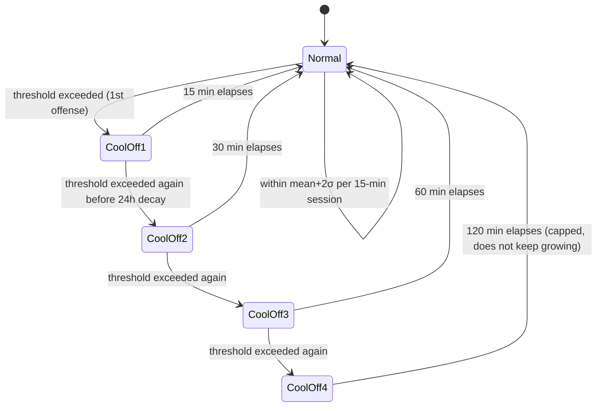

Storage: identical in-memory/short-TTL store as the guest session token (§8.1) — offense counts and cool-off state are never written to Postgres, keeping FR22's "no server-side storage" promise intact even under abuse.

### 8.3 Other Cross-Cutting Concerns

- **Offline/sync conflict handling**: resolved via the explicit version-check-on-open-and-save flow (FR32, §7.3) — not last-write-wins. Both trip-open and immediately-before-save compare the local/last-loaded copy against the canonical Postgres version; a conflict is always a user-facing save-as-or-overwrite choice, never a silent merge (PRD §7, §9 item 14; resolves §11.K). Whole-trip granularity only — no field-level diff/merge, by explicit anti-scope-creep decision.
- **Responsible-use caching discipline**: every external/shared dependency this system calls out to — self-hosted tiles, the open-elevation.com fallback, the weather provider, and now the geocoding service (FR34) — must cache with an expiry sized to that data's actual volatility (long for tiles/elevation/historical weather, short for live forecast) and never bulk-hammer or re-request data already held (PRD §4.4). This is a cross-cutting constraint on the `tiles`, `weather`, and `geocoding` routers alike, not just the elevation fallback that originally motivated it.
- **Size-class-driven UI adaptation**: layer visibility (FR8) and the contrast-mode override (PRD §6, §9 item 19) share one two-bucket model — large/fullscreen vs. compact/phone — keyed off actual viewport, not device type alone, so a windowed desktop client crossing the threshold moves buckets live. Both are synced account-level preferences carried over the same `sync` router as trip data (FR21); see §11.AA for whether FR32's version-check semantics apply to this preference sync too.
- **Power efficiency**: no metric or test currently defined (§11.I) — this NFR has no acceptance criteria yet, which is a gap for a mobile milestone (M7) sign-off.
- **Security boundary**: local FastAPI instance should bind to `localhost` only, never `0.0.0.0`, to avoid exposing an unauthenticated routing service on the local network by accident.

---

## 9. Deployment Architecture

- **Hosted**: Render Starter web service (FastAPI, always-on to keep OSMnx graphs warm in memory — PRD §5.2 explicit rationale for avoiding cold starts), Render Starter Postgres, Render free static site for the Flutter Web build. As of the §2 Principle 6 pivot, Postgres is also the system of record for Web sessions (§8.1) — not just accounts/sync/share — so the static site (Web client) and the web service (API) being separate Render origins is now a concrete cookie/CORS decision, not just a deployment detail (§11.T). As of the 2026-07-11 UX pass, the hosted service is also the tile-generation origin for all four targets (§5.2, §6) and, pending §11.X, potentially the geocoding origin for Desktop/Mobile too — worth confirming this doesn't quietly turn "auth+share+sync, narrowly scoped" (Principle 5) into a bigger surface than intended.
- **Local (Desktop)**: FastAPI + routing core run as a process on the user's own machine. **How that process starts is undecided** — see §11.A. Options range from "user runs `uv run uvicorn` manually per the current `backend/README.md`" to "Desktop app bundles/launches a packaged sidecar binary." This is worth resolving early since it directly affects onboarding friction for a project whose own MVP success criterion (§3.4) is "Greg uses it to plan one real ride."
- **CI/CD**: not yet defined anywhere in the PRD or repo — out of explicit scope per §5.4 ("No infrastructure/DevOps learning track"), but *some* minimal build-and-deploy path is still needed to get the Web static build and hosted API onto Render. Likely just Render's native git-push deploy, not a separate pipeline — flagging only so it isn't silently assumed away.

---

## 10. Mapping to Milestones

| Milestone | Components that come online |
|---|---|
| M1 | Routing Core only (all `weighting/` modules + `elevation`) — no FastAPI, no client |
| M2 | Local-mode FastAPI `routing` router wraps M1 |
| M3 | Desktop client + `core/map` + self-hosted tile pipeline + start/destination search (`geocoding` router, FR34) + route-shape selection (FR35) |
| M4 | `export` router + `export/` package (GPX/TCX/FIT) |
| M5 | `trip_split`, `weights_by_position`, `surface`, `layers`; `trips`/`weather` routers (historical only) |
| M6 | Hosted FastAPI stands up for the first time: `auth` (passkey + QR/CTAP hybrid + magic-link fallback/recovery), `share`, `sync` (trips via FR32 version-check + non-trip preferences), `guest` (+ browser-local client persistence), `tiles` routers; Postgres; Web client (both modes); trip library (FR36); guest→account import (FR37) |
| M7 | Mobile shells, offline bundle download/consumption, live forecast in `weather` |
| M8 | Content-layer features (`features/` additions only — no new backend containers) |
| M9 | Street View integration — deliberately undesigned per PRD §3.5 |

---

## 11. Open Questions Needing Product Guidance

Carried forward from PRD §9 (marked **PRD**) plus new ones surfaced by this architecture pass (marked **NEW**):

| # | Question | Source | Why it matters architecturally |
|---|---|---|---|
| A | How does the Desktop app start/manage the local FastAPI process — bundled sidecar binary, or a manually-run dev server? | NEW | Determines packaging/distribution work, not just code — affects M3 scope |
| B | Can Mobile ever request *new* route generation on-the-go (calling the hosted API when online), or is it strictly a consumer of pre-computed, downloaded bundles? | NEW | Changes whether Mobile needs a `routing` client at all, or only a bundle-download client |
| C | Flutter state management framework (Riverpod / Bloc / Provider / other)? | NEW | Not specified anywhere in PRD §5.3; needed before `core/` is scaffolded |
| D | Does local-mode FastAPI persist trip documents itself (its own SQLite), or does it stay fully stateless and let the Flutter Desktop client's `drift` store be the sole source of truth? | NEW | Affects whether "local mode" needs any database at all |
| E | ~~How does Web guest mode get tiles at all, since it has no local generation step?~~ **Distribution resolved (§5.2, §6; PRD item 8): the hosted `tiles` router generates on-demand per-trip-bbox, caches, and serves Web directly — the same cache is the origin Desktop/Mobile pull their offline bundle from.** Concrete generation tool (`tilemaker` vs. alternative) still undecided | **PRD #8** — distribution resolved this pass | Blocks M3 only for the tool choice now; the Web-distribution question is closed |
| F | Is OSM lodging/campground tagging alone sufficient for FR14, or does the Professional Tour Planner persona need a dedicated data source? | **PRD #9** | Determines whether `trips` router needs a second external data integration beyond OSM |
| G | Weather provider for FR15 — `open-meteo` vs. OpenWeatherMap vs. other? | **PRD #10** | First non-OSM, non-local external dependency in the core planning flow; needed to build the `weather` router |
| H | Are cafe/restaurant rest-stops OSM-tag-only, or does this persona need richer curated data (hours, reviews)? | **PRD #11** | Same shape of question as F — another potential external integration |
| I | What's the actual acceptance metric for the "power efficiency" NFR (battery %/hour, GPS poll interval)? | **PRD #12** | Currently no test or target exists for an M7 sign-off gate |
| J | Data source/feasibility for FR30/FR31 (frequently-cycled routes, popularity/heatmap data)? | **PRD #13** | Would introduce a new external dependency in tension with the local-first/open-data bias |
| K | ~~Does sync conflict resolution (FR21) stay last-write-wins indefinitely, or is field-level merge ever needed?~~ **Resolved (FR32, §7.3, §8.3): explicit version-check-on-open-and-save replaces last-write-wins entirely — whole-trip granularity, user chooses save-as or overwrite on conflict, never a silent merge.** | **PRD #14** — resolved this pass | `sync` router now has a concrete reconciliation contract, not just an open data-model question |
| L | ~~What rate-limiting/anti-abuse mechanism and threshold protects the guest-tier compute endpoint (FR22)?~~ **Mechanism decided (§8.2): UAT-calibrated 15-min-session baseline, mean+2σ threshold, notify-and-cool-off with progressive escalation.** Exact mean/σ values still pending real UAT data | **PRD #15** — policy resolved this pass | Needed before hosted launch (M6); the *shape* is no longer blocking, only the numeric calibration is |
| M | Confirming the core reading in §4 of this doc: one FastAPI+routing-core codebase, deployed in two modes (local sidecar vs. hosted multi-tenant) via config, not two separately maintained services? | NEW | This is this document's central architectural inference from PRD §4.4/§5.2 — not stated explicitly there; worth an explicit sign-off before M2 locks in the API's shape |
| N | For a *signed-in* Desktop user: does routing compute still happen locally (hosted API used only for auth/share/sync), or does going signed-in reroute all calls through the hosted API? | NEW | Determines the branching logic in `core/api/`'s base-URL resolution — real code depends on this, not just deployment topology |
| O | ~~Account recovery when every registered passkey/device is lost — the PRD has no answer for this at all.~~ **Resolved by PRD FR19 (2026-07-11 UX pass): magic link is now explicitly named as the account-recovery path.** §8.1's proposed mechanism (reuse the registration ceremony gated by a magic link, with a notify-existing-devices step) is now the specified design | **PRD FR19** — resolved this pass | Device-notification infra (push/email) is still an implementation detail worth scoping early, but the design itself no longer needs product sign-off |
| P | Native passkey ceremonies on iOS/Android require the app to be linked to the hosted domain via platform config (`apple-app-site-association`, Android `assetlinks.json`) — this can't be finalized until the hosted domain is chosen | NEW | Blocks passkey work on mobile specifically; easy to miss until integration time, cheap to resolve early once a domain is picked |
| Q | Transactional email provider for magic links (deliverability, DKIM/SPF setup, per-provider rate limits)? | NEW | Not mentioned anywhere in the PRD; magic-link delivery reliability directly gates every registration/recovery flow in §8.1 |
| R | Confirm the proposed `sign_count` policy (§8.1: log but don't hard-enforce, since synced passkeys report a static counter) is acceptable, given it trades away some clone-detection strength for compatibility with iCloud Keychain/Google Password Manager-synced passkeys | NEW | A real security trade-off, not just an implementation detail — worth an explicit call rather than a silent default |
| S | Who runs UAT for §8.2's rate-limit baseline, with what sample size/user mix, and does the request-volume distribution actually turn out normal enough for a mean+2σ threshold to be meaningful (vs. e.g. right-skewed, needing a percentile-based threshold like p95/p99 instead)? | NEW | The mean+2σ approach assumes a roughly normal distribution; a solo-project UAT sample may be too small/skewed to trust that assumption without a sanity check |
| T | The Flutter Web static build (Render free static site) and the hosted FastAPI service (Render Starter web service) are separate origins — does the Web session cookie (§8.1) go same-site via a reverse-proxy/custom-domain rewrite (one apparent origin, `SameSite=Lax`), or cross-site (`SameSite=None; Secure` + full CORS credentialed-request config)? | NEW — surfaced by the 2026-07-10 pivot | Directly blocks implementing Web's new conventional session model; a wrong default here (e.g. overly permissive CORS to make cookies "just work") is a real vulnerability class this design didn't previously have to think about |
| U | Now that Web is no longer architecturally local-first (§2 Principle 1), does FR18's "full planning parity with Desktop" still imply any Web offline capability (e.g. service-worker/PWA caching for a signed-in user's own trips), or is Web now intentionally online-only, simplifying FR18's scope? | **PRD #18** | Answered in PRD §4.4/FR18 as "remains open" — Web is confirmed online-only/server-backed as the baseline, but whether any offline capability is ever added is explicitly still undecided |
| V | ~~What geocoding library/tool backs FR34?~~ **Tool resolved (this pass): OSMnx's own `geocode`/`geocoder` module, matching §5.1's existing "use OSMnx's own X, not a separate pipeline" bias.** Still open, per PRD #20: which Nominatim endpoint OSMnx points at — the public, rate-limited `nominatim.openstreetmap.org`, or a self-hosted instance? | **PRD #20** — narrowed this pass | OSMnx's geocoder is a thin HTTP call-through with no bundled index, so this is purely an infra/cost decision now, not a library choice; needed before M3's `geocoding` router can be built. Also: OSMnx caches HTTP responses to disk by default, but with no TTL — that alone doesn't satisfy the responsible-use NFR's "reasonable expiry" requirement (§4.4 PRD), so the `geocoding` router still needs its own expiry logic on top |
| W | Is Mobile's bundled-extract, in-bounds-only search sufficient for offline start/destination entry (FR34), and must a point-to-point destination (FR35) be resolved before going offline? | **PRD #21** | Affects whether Mobile needs any bundled geocoding index at all, or just a bbox-filtered lookup against already-downloaded OSM data |
| X | Should FR34 (start/destination entry — the mandatory first step of every flow) work fully offline on Desktop, consistent with the local-first hard guarantee (§2 Principle 1), or is a live geocoding call an acceptable narrow exception alongside FR15/FR21? OSMnx's geocoder has no offline mode (§11.V), so this isn't a free implementation detail — it's a product call on whether local-first extends to route *entry*, not just route *generation* | NEW — surfaced by the 2026-07-11 pass | PRD doesn't currently address this; Desktop is the one target where local-first is a hard guarantee, and FR34 is now gating every flow, so it needs an explicit answer rather than an implementation default |
| Y | QR-code cross-device authorization (FIDO2/CTAP hybrid) is now the *preferred* new-device path (FR19, §8.1) — is Flutter/platform plugin support mature enough on all four targets to lead with it, or does the existing passkey-plugin-maturity risk (PRD §7) apply here even more than to the magic-link fallback? | NEW — surfaced by the 2026-07-11 pass | Changes which path gets built and tested first at M6; a QR flow that doesn't work reliably cross-platform would force magic-link to become the de facto primary path despite the PRD's stated preference |
| Z | FR37's guest→account import is additive by the flow drafted in §7.5 — what happens if the imported guest trip collides with an existing trip in the account (same name, or substantively the same route already saved)? | NEW — surfaced by the 2026-07-11 pass | FR37's acceptance criteria don't address collision; left unresolved, an import could either silently duplicate or need its own conflict UX distinct from FR32's version-check (which assumes one pre-existing shared trip, not two independently-created ones) |
| AA | Does FR32's version-check-on-open-and-save apply to the non-trip preferences (layer visibility by size-class, contrast-mode override) now carried over the same `sync` router (FR21), or is plain last-write-wins acceptable there since they're low-conflict single-value settings? | NEW — surfaced by the 2026-07-11 pass | PRD states both sync "the same way" without specifying whether that includes the conflict-UX, not just the transport — worth an explicit call so `sync` router semantics aren't ambiguous per-field |

---

## Appendix: Traceability (FR → Component)

| FR | Component(s) |
|---|---|
| FR1–FR5 | `routing_core/weighting/`, `routing_core/elevation` |
| FR6 | FastAPI `routing` router |
| FR7 | Flutter `core/map` |
| FR8 | FastAPI `layers` router (metadata), `sync` router (size-class-bucketed persistence), Flutter `core/map` layer toggles + `core/theme` (shared bucket model) |
| FR9 | `routing_core/export/` (gpx, tcx, fit) |
| FR10 | `routing_core/trip_split` (waypoint-constrained routing) |
| FR11 | `routing_core/trip_split` (daily mileage/elevation splitting) |
| FR12 | `routing_core/surface` |
| FR13 | `routing_core/weights_by_position` |
| FR14 | FastAPI `trips` router (OSM lodging tags; possible external source — §11.F) |
| FR15 | FastAPI `weather` router (provider TBD — §11.G) |
| FR16 | Flutter `features/offline`, `core/storage` |
| FR17 | Flutter Android/iOS platform shells |
| FR18 | Flutter Web platform shell + hosted FastAPI (guest + signed-in) |
| FR19 | FastAPI `auth` router, Flutter `core/auth` |
| FR20 | FastAPI `share` router |
| FR21 | FastAPI `sync` router (trips + preferences), Postgres |
| FR22 | FastAPI `guest` router, rate limiter, Flutter browser-local store (IndexedDB/localStorage) |
| FR23 | `routing_core/weighting/most_art_history.py` extension |
| FR24 | Flutter `features/` content layer (M8) |
| FR25 | FastAPI new router (M8, requires FR19 accounts) |
| FR26 | `routing_core/export/geojson.py` |
| FR27/FR28 | Undesigned by choice — M9, external Street View dependency |
| FR32 | FastAPI `sync` router (version-check-on-open/save logic), Postgres trip versioning |
| FR33 | Postgres (version retention) — M10, undesigned by choice |
| FR34 | FastAPI `geocoding` router, Flutter `core/map` (search/tap/GPS entry) |
| FR35 | FastAPI `routing` router (shape parameter), Flutter `core/map`/`features/routing` (shape selector) |
| FR36 | FastAPI `trips` router (library operations), Flutter trip-library UI |
| FR37 | FastAPI `trips` router (import endpoint), Flutter guest→account claim flow (§7.5) |
