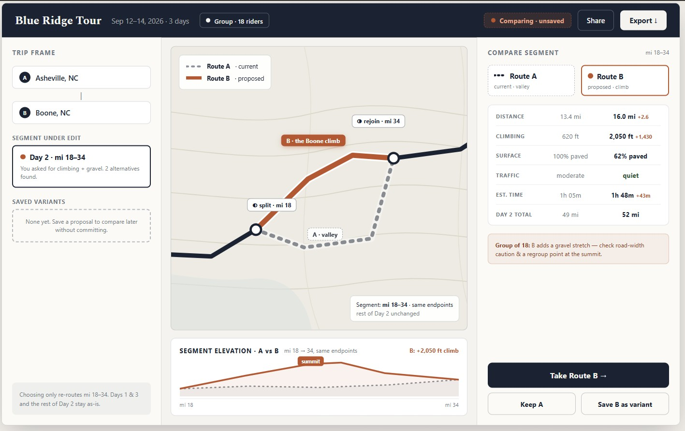

# Cycle Tour Planner

A personal route planner for cyclists who care about *why* a route goes where it goes — flattest, hilliest, quietest, straightest, or most interesting — rather than just logging a ride after the fact. It also handles multi-day trip logistics: lodging, water stops, weather, and daily mileage/elevation budgets, not just a single loop around the block.

This is also very much a learning project. The stack is fixed on purpose as a project goal in itself:

- **OSMnx** (Python) for the routing core — custom multi-factor edge weighting over OpenStreetMap data
- **FastAPI** as the middle layer — typed request/response models, auto-generated OpenAPI docs
- **Flutter/Dart**, one codebase across Desktop, Android, iOS, and Web

The app is **local-first, not local-only**: Desktop and Mobile run the routing core on-device inside a local sidecar process, so every P0 capability works offline. Web is a deliberate exception — it always computes server-side, since there's no browser-side path to run OSMnx.

## Where things stand

Early and scaffolding-only — no product code yet beyond a FastAPI health-check stub and the default Flutter starter app. The design work is well ahead of the build:

| Doc | What it covers |
|-|-|
| [`Cycle_Tour_Planner_PRD.md`](Cycle_Tour_Planner_PRD.md) | Product requirements — problem, personas, functional requirements, milestones. Start here |
| [`ARCHITECTURE.md`](ARCHITECTURE.md) | System design — component map, the local-sidecar decision, data model, plugin architecture |
| [`ROADMAP.md`](ROADMAP.md) | Build order, sequenced by dependency (solo project — no calendar dates) |
| [`UX.md`](UX.md) | Outdoor-use UX principles (glare, gloves, offline-as-default, low cognitive load) |
| [`Brand Guide.md`](Brand%20Guide.md) | Visual identity and color system |

Treat the PRD and ARCHITECTURE docs as the current best guess, not a fixed spec — they'll keep evolving as building starts and reality pushes back on the plan.

### Current wireframe

A route-comparison view from the in-progress design: proposing an alternate segment (climb + gravel) against the current route, with a live delta on distance, climbing, surface, and estimated time before committing.



## Repo layout

```
backend/   FastAPI service (ctp-service) — currently a health-check stub
client/    Flutter app — currently the default starter scaffold
assets/    Design assets (wireframes, rasters)
```

## GeoTIFF source

### Citation
European Space Agency (2024). Copernicus Global Digital Elevation Model. Distributed by OpenTopography. https://doi.org/10.5069/G9028PQB. Accessed 2026-07-12

### License
© DLR e.V. 2010-2014 and © Airbus Defence and Space GmbH 2014-2018 provided under COPERNICUS by the European Union and ESA; all rights reserved.
