# Cycle Tour Planner — Wireframes

High-fidelity screens for the Cycle Tour Planner MVP, organized by the user journey. Rendered in the real brand system.

**Contrast modes** — the app runs one adaptive contrast system:
- **Indoor Contrast** (Desktop / Web): Deep Slate Blue on Alabaster Parchment, dense, soft.
- **Outdoor Contrast** (Mobile): Absolute Obsidian + Pure Crisp White, stark, sunlight-legible.

**Theme accents** — River Valley Teal (flattest), Ridge Line Terracotta (most climbing), Serene Forest (lowest traffic), Linear Horizon Blue (fewest turns), Curated Burgundy (art/history).

> The images below are exported from the interactive source, [`Wireframes.dc.html`](./Wireframes.dc.html) — open that file in a browser for the live, editable version (it also contains the earlier lo-fi exploration turns). Requires `support.js` alongside it.

---

## Stage 1 · Getting started

### First run — an empty library
**`15a` · Desktop**

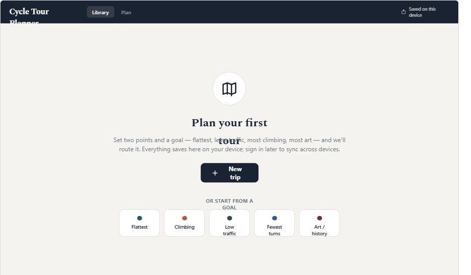

A brand-new user, before any trip exists. Instead of a blank screen, the app leads with what it does and one obvious way to begin. Planning never waits on a sign-up — work saves locally on the device immediately; an account is offered later only to sync across devices.

**Key functions**
- One primary action: New trip
- Five goal starters seed a plan in a click
- Local-first — no account required to plan
- Header states plainly where work is saved

---

### First run — mobile
**`15b` · Mobile**

The same zero-state on the phone, in the high-contrast Outdoor theme. Compact value proposition, goal chips, and a thumb-friendly New trip button pinned at the bottom.

**Key functions**
- Thumb-zone New trip button
- Goal chips seed a themed plan
- Local-first; sign in later to sync

---

## Stage 2 · Finding your trips

### Trip library
**`14b` · Desktop**

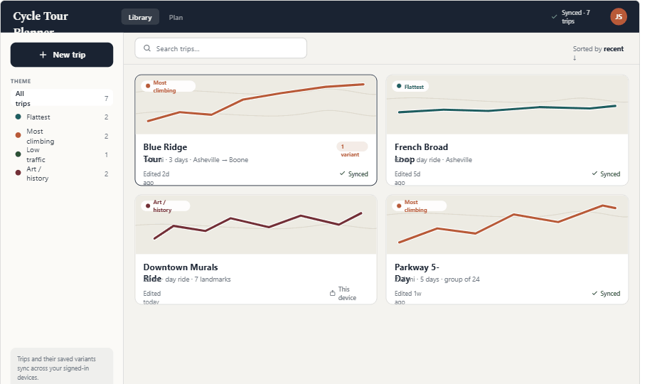

Where saved tours and their route variants live. Searchable and filterable by goal; each card shows route shape, distance and days — and an honest sync state so the rider always knows whether a trip is only on this device or backed up to their account.

**Key functions**
- Filter by theme, search by name
- Cards show map preview, stats, variant count
- Sync state per trip: Synced vs This device
- Start a New trip from the rail

---

### Trip library — mobile
**`14d` · Mobile**

The library on the phone. Same information model — theme, stats, variant and sync badges — as scrollable cards, with search on top and New trip in the thumb zone.

**Key functions**
- Scrollable trip cards with theme + sync badges
- Search
- Offline availability shown per trip

---

### Claim your work
**`16a` · Desktop**

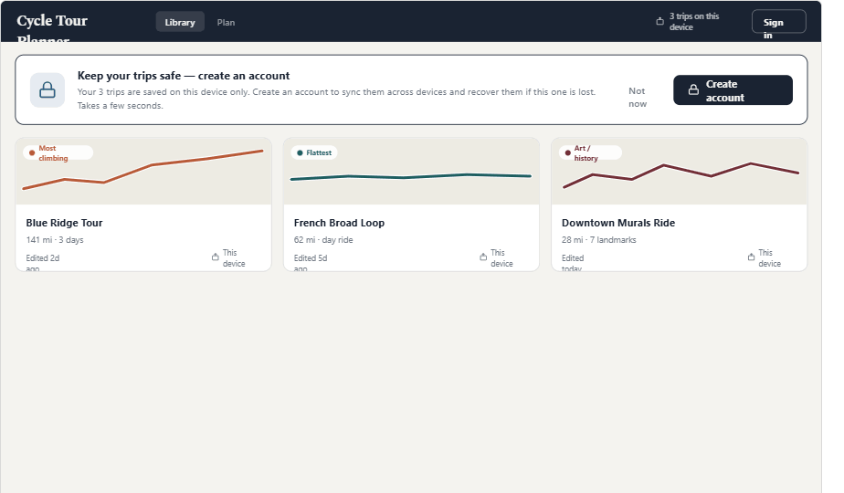

A guest has been planning locally. A calm, non-blocking banner explains why an account helps — sync across devices and recover the trips if this device is lost — and offers it without ever gating planning. Local trips sit right below, marked as living on this device.

**Key functions**
- Non-blocking banner — planning is never gated
- Explains the benefit: sync + recovery
- Create account or Not now / dismiss
- Local trips remain fully usable, badged “This device”

---

### Claim your work — mobile
**`16b` · Mobile**

The same account prompt on the phone, as a dismissible card at the top of the local library. Clear benefit, one primary action, and an easy way out.

**Key functions**
- Dismissible card atop the library
- Create an account — one action
- Local trips intact below, marked “This device”

---

## Stage 3 · Planning & refining

### Comparing route alternatives
**`10a` · Desktop**

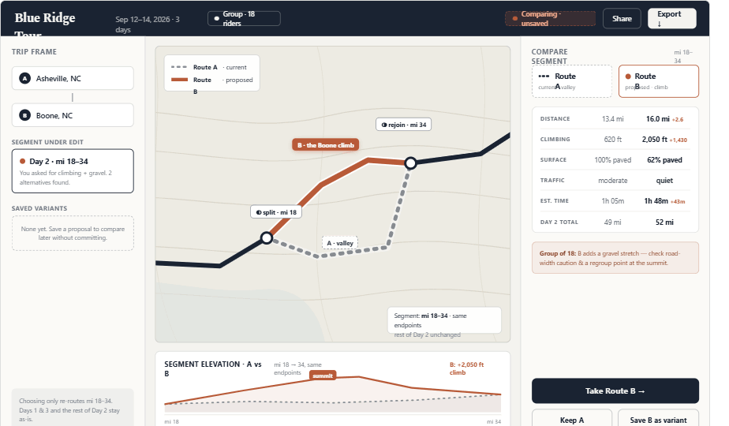

The heart of the product. When the planner changes a goal on part of a route — here climbing + gravel across miles 18–34 — the app proposes a new line without discarding the current one. Both routes stay on one map (current “Route A” as a ghost, proposed “Route B” bold) with a side-by-side comparison. Nothing is committed until the planner decides.

**Key functions**
- Both routes on one map: ghost = current, bold = proposed
- Overlaid elevation for the affected segment
- Compare card with deltas: distance, climbing, surface, traffic, time, day total
- Decide: take B, keep A, or save B as a variant

---

### Saved variants in the day timeline
**`9a` · Desktop**

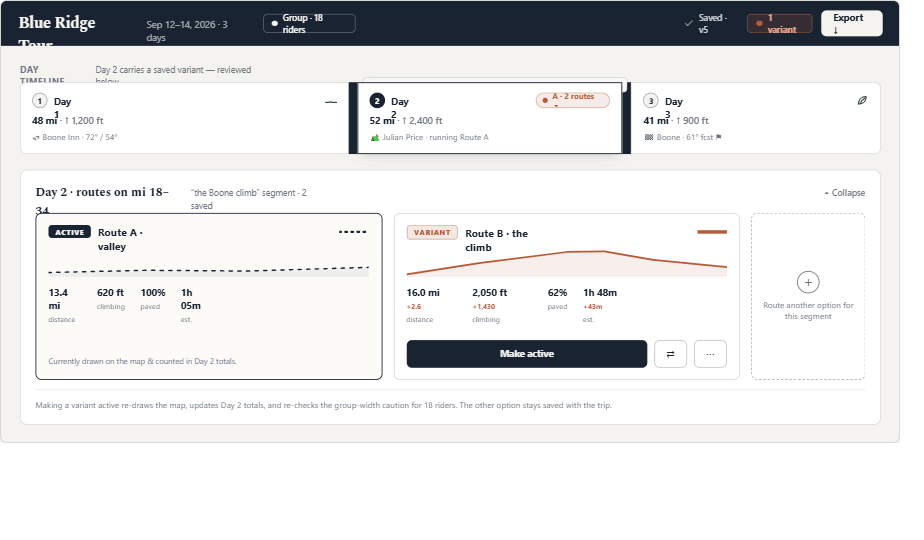

After saving an alternative, the planner returns to the whole-tour view. The day still runs its active route — nothing committed — but now carries a variant marker. Expanding it compares the active route against the saved option with deltas, so the planner can flip the active line or keep collecting options.

**Key functions**
- Day card marked with a stacked variant tab
- Expand to compare active route vs saved variant
- “Make active” re-draws the map and updates day totals
- Variants travel with the trip; totals unchanged until made active

---

### When constraints can’t be met
**`16c` · Desktop**

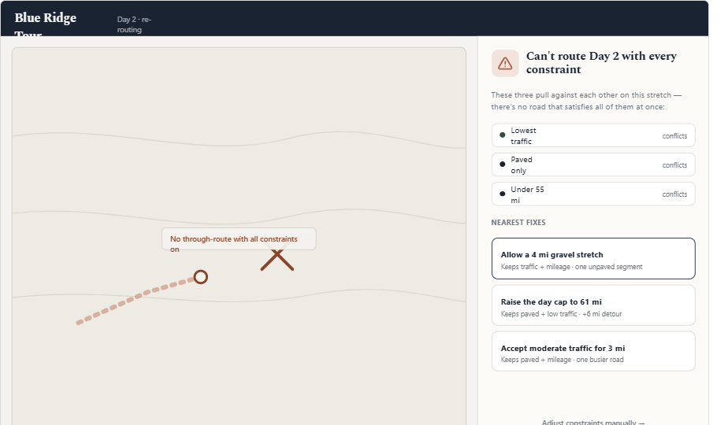

The honest planning dead-end. When the routing engine can’t satisfy every constraint at once, it never shows a raw error — it names exactly which constraints conflict, then offers the nearest fixes with their trade-offs, so the planner can move forward with one click or adjust manually.

**Key functions**
- Names the specific conflicting constraints
- Nearest fixes, each with its trade-off
- One-click apply, or adjust constraints manually
- Map shows where the route breaks

---

## Stage 4 · Export & hand-off

### Export route
**`14a` · Desktop**

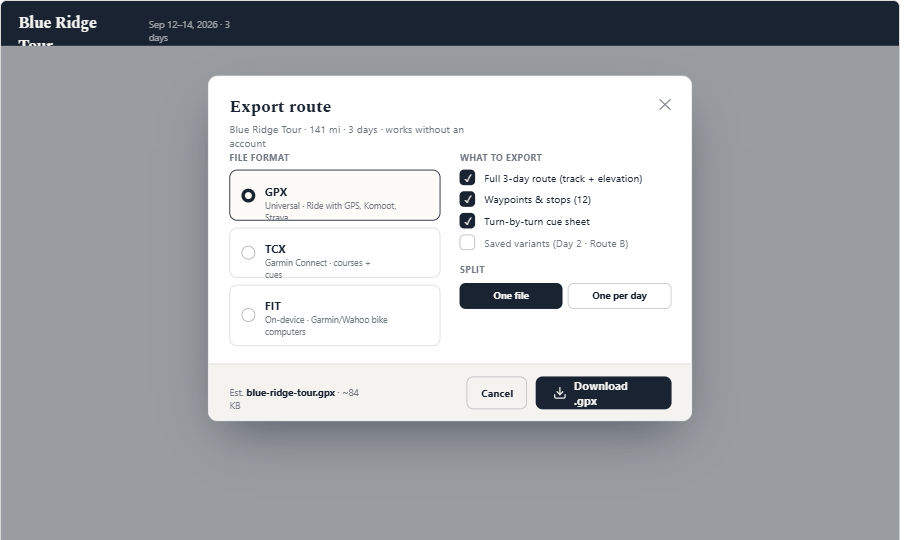

The durable, portable copy of the plan. The planner picks a file format for their device or service, chooses exactly what to include, and whether to split by day. Export works with no account.

**Key functions**
- Formats: GPX (universal), TCX (Garmin), FIT (bike computers)
- Include: route, waypoints, cue sheet, optional saved variants
- One file, or one file per day
- Filename & size preview

---

### Export complete
**`15d` · Desktop**

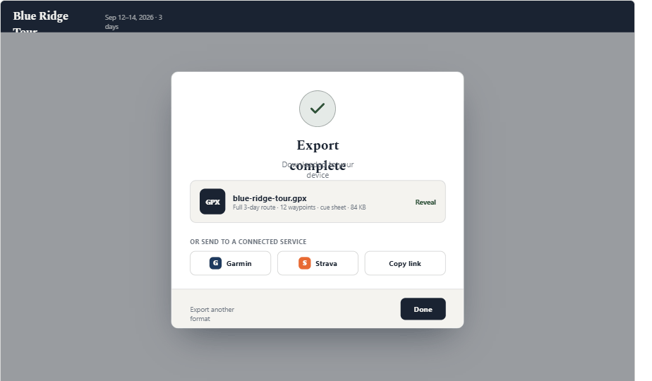

Confirmation that the file wrote, with the exact filename and contents. From here the planner can reveal the file, push it to a connected service, copy a share link, or export another format.

**Key functions**
- Clear success confirmation with file summary
- Reveal in the file system
- Send to a connected service (Garmin, Strava) or copy link
- Export another format without starting over

---

### Export — mobile
**`14c` · Mobile**

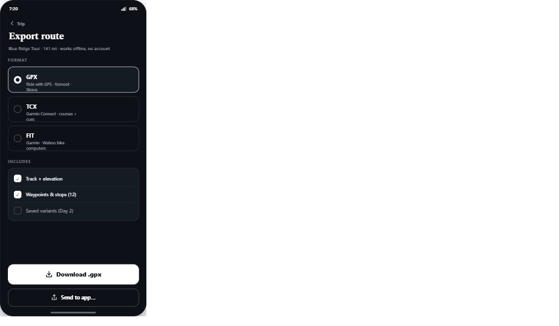

The same export on the phone in Outdoor Contrast: a format list with target-service hints, an includes checklist, and a large Download plus “Send to app” hand-off in the thumb zone.

**Key functions**
- Format list with target-service hints
- Includes checklist
- Download + Send to app, thumb-reachable

---

### Export success & share — mobile
**`15c` · Mobile**

A bottom sheet confirms the file saved and offers immediate hand-off to Garmin, Strava, the system share sheet, or Files — so the route reaches the rider’s head unit in one step.

**Key functions**
- Success confirmation with file summary
- Hand-off targets: Garmin, Strava, system share, Files

---

## Stage 5 · On the ride

### Pre-ride route review
**`11a` · Mobile**

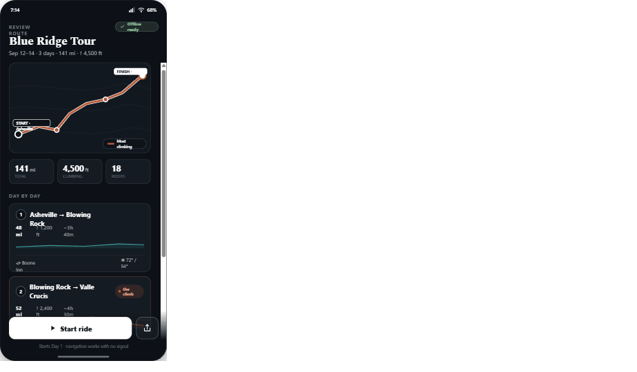

At the trailhead, the rider gives the whole tour one last look before clipping in. A whole-trip map, summary stats, day-by-day cards with elevation and weather, and an unmistakable offline-ready status — then a big Start ride action. Everything works with no signal.

**Key functions**
- Whole-trip map + summary (distance, climbing, riders)
- Day cards with elevation, lodging, weather
- Offline-ready status; files confirmed on device
- Start ride pinned in the thumb zone

---

### Day cue sheet (turn-by-turn)
**`12a` · Mobile**

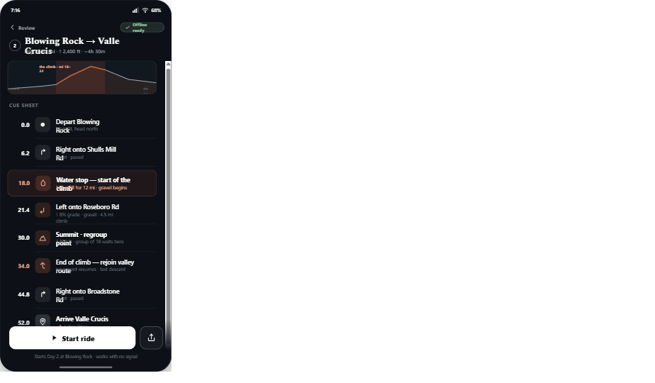

Tapping a day opens its cue sheet — the maneuver-by-maneuver list with cumulative mileage, direction, road name and notes. Key moments like the water stop, the climb, and the group regroup point at the summit are called out.

**Key functions**
- Maneuver list with cumulative mileage
- Climb segment banded for glanceability
- Waypoints (water, summit, regroup) highlighted
- Start ride from the day

---

### In-ride navigation
**`13a` · Mobile**

On the handlebar, mid-ride. Everything shrinks to what matters at speed and in sunlight: a large next-maneuver banner, the live map with the route ahead, the upcoming water-stop waypoint with distance-to-go, a compact climb readout, and ride stats. Controls sit in the thumb zone.

**Key functions**
- Large next-turn banner + “then” preview
- Live map with thumb-zone controls
- Upcoming waypoint card (water stop) with distance
- Elevation/climb readout + ride stats; pause control

---

### GPS lost mid-ride
**`16d` · Mobile**

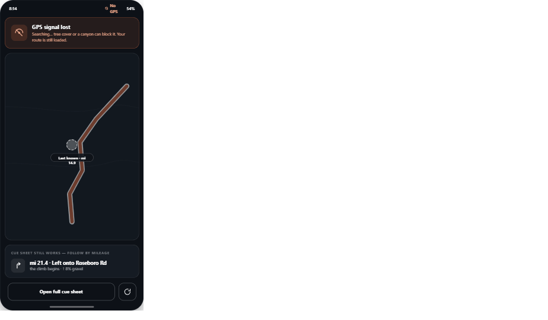

The honest on-the-ride dead-end. If the phone loses GPS, navigation degrades gracefully rather than failing: a clear “signal lost / searching” banner, the map frozen at the last known position, and the reassurance that the cue sheet still works, so the rider follows by mileage until signal returns.

**Key functions**
- Clear signal-lost / searching banner
- Map frozen at last known position
- Cue sheet still works — follow by mileage
- Route stays loaded; no data lost

---

_Generated from `Wireframes.dc.html`. To regenerate an image, open the source, and screenshot the frame with the matching `#id`._
